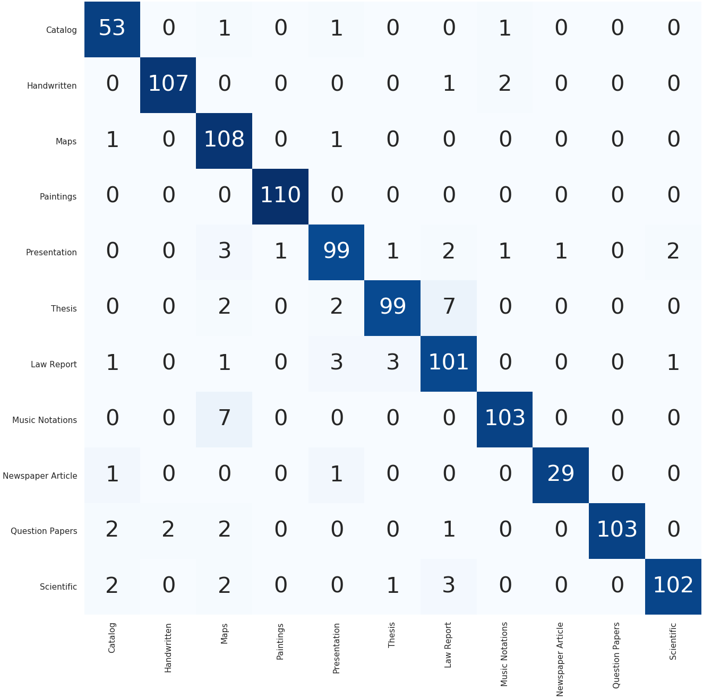

# DocumentClassify
 This repository contains the Heterogeneous Learning Resource (HLR) Dataset  and the code for a deeplearling model for evaluating it.

The proposed HLR dataset contains `3167` images from `11` classes, namely: catalog,  handwritten,  law reports,  maps,  music notations,  newspaper articles,  paintings,  presentation,  question paper,  scientific articles, and thesis. Additionally, a small set of multi-page documents are also included in the dataset for testing the said problem. 

 
 
The dataset is located in the folder NDLI_data.


The Deeplearning architecture desctibed below is defined in the `model.py` script. The entire project can be run by the following comand: 
```
python run_experiments.py
```

 

The model achives an impressive `94.15%` accuracy.

 


This is the source code for the poster paper [Automatic Recognition of Learning Resource Category in a Digital Library](10.1109/JCDL52503.2021.00039) ( [Arxiv preprint](https://arxiv.org/pdf/2401.12220) ), presented in JCDL 2021.
